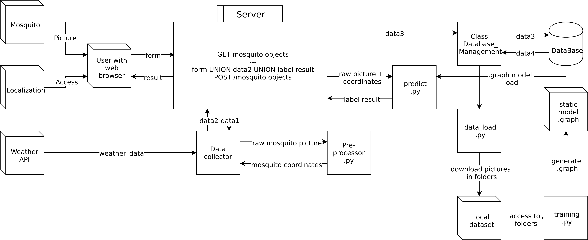
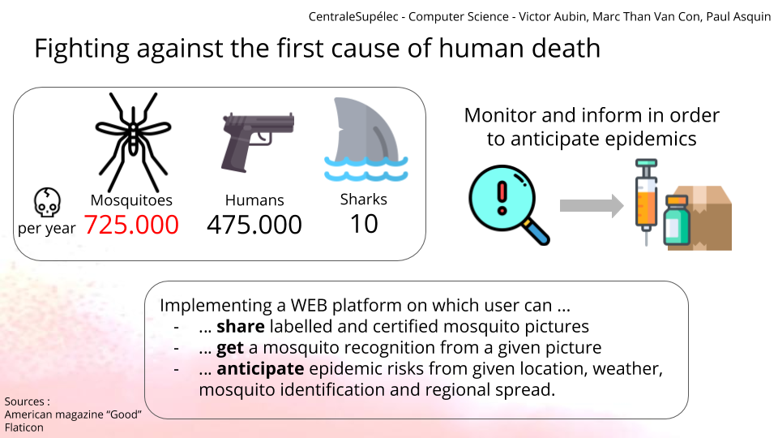

# mosquito-monitoring
Identify mosquito species and collect data to anticipate epidemics propagation
for a CentraleSupelec project

github repository:
https://github.com/mosquito-boys/mosquito-monitoring

Deployed app (old) : [mosquito-monitor.herokuapp.com](https://mosquito-monitor.herokuapp.com)   
Deployed app (our own server with persistent database, temporary url) : [mosquito.paulasquin.com](https://mosquito.paulasquin.com) 

## Project purpose
This project aims to monitor and later anticipate mosquito related epidemics.
Crossing the information about mosquito species, localization, temperature and population density may be really powerful to intuite the evolution or the apparition of an epidemic. Thus, we want to create a plateform where anyone can participate to this big-scale survey.

The user can upload a mosquito picture and will be asked to provide additional information as they localization or the mosquito species if known.
Those information will be written in a database, and a Machine Learning algorithm will try to identify where the mosquito is located in the image and what is its species. 

## Project graph
 

We initiated a Dockerfile and a docker-compose.yml file in order to wrap all the requirements and dependancies of this project.

You have then 2 choices:

- The 1st one is to install all the requirements (see Installation below)
- The second one is to have Docker (version 1.13.0+ and above) installed and running on your OS

## Code explainations

### flask server

server.py create the server and launch it with the routes

### db_model

Classes which represent the objects used in the project and the corresponding model for the database
The db is an SQLite database created automatically when the server is launched in a SQLite.db file
Every successful upload leads to the creation of a user, a mosquito and store them in the db

### classification

Scripts and classes for classification purpose (preprocessing, training, prediction)

#### Label a mosquito
Import the mosquito classification module
```
import classification.command_classification as command_classification
```

Request the labelling
```
command_classification.label_automatic(path_img)
```

Return example 
```
[['aedes', '0.8780854'], ['culex', '0.11636846'], ['anopheles', '0.0055461014']]
```

### dataset

Initial dataset for training

### dataset_to_be_validated

Uploaded mosquito pictures from users. Some expert should check it and decide the right label for the picture to be added to the dataset

### preprocessed_dataset

Transformed pictures from the preprocessing action. Each preprocessed picture correspond to a picture in the dataset

### tests

Don't run directly the scripts independently.
To test them, run the corresponding test script like below:

```
python3 -m tests.my_test
```

### utilities

contains some classes useful for the project
EnvReader.py => read the .env file 
Errors.py => some custom Exception classes
LRU.py => multithreaded class that watch the static/tmp folder and remove the oldest files when the maximum size of 4 files is exceeded


## Installation of dependencies (only if you are not using Docker)

NB: You need to have python 3.6 installed and **not** 3.7 installed on your machine.

```bash
pip3 install -r requirements.txt
```

You may have to install some additional libraries for opencv.

## Start server

The server will listen on port 5000.

### With Docker

```bash
docker-compose up
```

If you want to rebuild the project you can run 

```bash
docker-compose build
```

### Without Docker
```
python3 server.py
```

## Use the webapp

There is 3 tabs.

The first one let you upload a mosquito.
We suggest you choose from the ... folder a mosquito picture and a location

The second one is just an information page

The last one show a map with all mosquitos found so far. The db is initialized with 3 mosquitos, so you can use the map feature

# Project Slides
 
 
