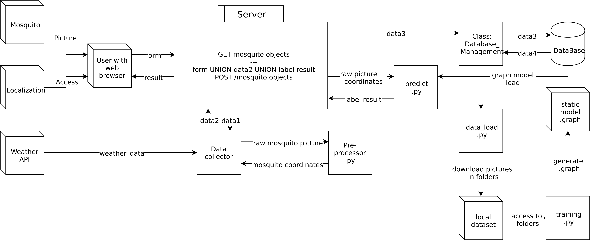

# mosquito-monitoring
Identify mosquito species and collect data to anticipate epidemics propagation
for a CentraleSupelec project

Deployed app : [https://mosquito-monitor.herokuapp.com/](https://mosquito-monitor.herokuapp.com/)

# Introduction
## Project purpose
This project aims to monitor and later anticipate mosquito related epidemics.
Crossing the information about mosquito species, localization, temperature and population density may be really powerful to intuite the evolution or the apparition of an epidemic. Thus, we want to create a plateform where anyone can participate to this big-scale survey.

The user can upload a mosquito picture and will be asked to provide additional information as they localization or the mosquito species if known.
Those information will be written in a database, and a Machine Learning algorithm will try to identify where the mosquito is located in the image and what is its species. 

## Project graph
 

We initiated a Dockerfile and a docker-compose.yml file in order to wrap all the requirements and dependancies of this project.

You have then 2 choices:

- The 1st one is to install all the requirements (see Installation below)
- The second one is to have Docker (version 1.13.0+ and above) installed and running on your OS


## Installation (only if you are not using Docker)

NB: You need to have python 3.6 installed and **not** 3.7 installed on your machine.

```
pip3 install -r requirements.txt
```

You may have to install some additional libraries for opencv.

## Start server

### With Docker
```
docker-compose up
```

### Without Docker
Debug mode
```
FLASK_APP=server.py FLASK_DEBUG=1 python3 -m flask run
```
Normal mode
```
python3 server.py
```

The server should be listening to port 5000

## Label a mosquito
Import the mosquito classification module
```
import classification.command_classification as command_classification
```

Request the labelling
```
command_classification.label_automatic(path_img)
```

Exemple of return
```
[['aedes', '0.8780854'], ['culex', '0.11636846'], ['anopheles', '0.0055461014']]
```

## Additionnal commands

Remove the database (useful for development purpose)

```
rm ./sqlite.db
```

Freeze local packages into requirements.txt with following command

```
pipreqs ./ --force      
```

# Run the tests

Don't run directly the scripts independently.
To test them, run the corresponding test script like below:

```
python3 -m tests.my_test
```

## Retrain

To run a retrain of Inception

```
python3 -m tests.test_command_classification --retrain
```
You shall now wait for 3 to 7 minutes depending on your CPU

## Prediction

To run an image labelling test

```
python3 -m tests.test_command_classification --label [optional path to one or more images]
```
Ouput :

```
Testing image labelling
/home/paul/Projects/POOA/mosquito-monitoring/classification/tensorflow
['/home/paul/Projects/POOA/mosquito-monitoring/classification/tensorflow/export_1/graph.db']
['/home/paul/Projects/POOA/mosquito-monitoring/classification/tensorflow/export_1/labels.txt']
['/home/paul/Projects/POOA/mosquito-monitoring/classification/tensorflow/export_1/cmd.txt']
python3 /home/paul/Projects/POOA/mosquito-monitoring/classification/label_image.py --graph=/home/paul/Projects/POOA/mosquito-monitoring/classification/tensorflow/export_1/graph.db --labels /home/paul/Projects/POOA/mosquito-monitoring/classification/tensorflow/export_1/labels.txt --input_layer=Placeholder --output_layer=final_result --image /home/paul/Projects/POOA/mosquito-monitoring/dataset/aedes/pic_001.jpg
2018-10-23 14:28:34.619292: I tensorflow/core/platform/cpu_feature_guard.cc:141] Your CPU supports instructions that this TensorFlow binary was not compiled to use: AVX2 FMA
[['aedes', '0.8780854'], ['culex', '0.11636846'], ['anopheles', '0.0055461014']]

```


# Project Slides
 
 
