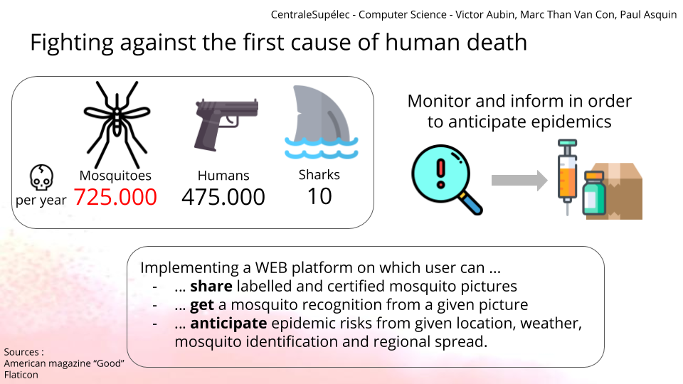

# mosquito-monitoring
Identify mosquito species and collect data to anticipate epidemics propagation
for a CentraleSupelec project

Deployment : [https://mosquito-monitor.herokuapp.com/](https://mosquito-monitor.herokuapp.com/)

# Introduction
## Project purpose
The purpose of this project is to be able to monitor and later anticipate mosquito related epidemics.
Crossing the information about mosquito species, localization, temperature and population density may be really powerful to intuite the evolution or the apparition of an epidemic. Thus, we want to create a plateform where anyone can participate to this big-scale survey.

The user can upload a mosquito picture and will be asked to provide additional information as they localization or the mosquito species if known.
Those information will be written in a database, and a Machine Learning algorithm will try to identify where the mosquito is located in the image and what is its species. 

## Project graph
 

You need python 3.6 and the dependencies installed 

# Installation

```
pip3 install -r requirements.txt
```


## Start server

```
FLASK_APP=server.py FLASK_DEBUG=1 python3 -m flask run
```

## Additionnal commands

Remove the database (useful for dev purpose)

```
rm ./sqlite.db
```

Freeze local packages into requirements.txt with following command

```
pipreqs ./ --force      
```

## Run the tests

Don't run directly the scripts independently.
To test them, run the corresponding test script like below:

```
python3 -m tests.my_test
```

### Retrain

To run a retrain of Inception

```
python3 -m tests.test_command_classification --retrain
```
You shall now wait for 3 to 7 minutes depending on your CPU

### Prediction

To run a test for the image labelling on the default image 

```
python3 -m tests.test_command_classification --label [optional path to one or more images]
```
Ouput :

```
Testing image labelling
/home/paul/Projects/POOA/mosquito-monitoring/classification/tensorflow
['/home/paul/Projects/POOA/mosquito-monitoring/classification/tensorflow/export_1/graph.db']
['/home/paul/Projects/POOA/mosquito-monitoring/classification/tensorflow/export_1/labels.txt']
['/home/paul/Projects/POOA/mosquito-monitoring/classification/tensorflow/export_1/cmd.txt']
python3 /home/paul/Projects/POOA/mosquito-monitoring/classification/label_image.py --graph=/home/paul/Projects/POOA/mosquito-monitoring/classification/tensorflow/export_1/graph.db --labels /home/paul/Projects/POOA/mosquito-monitoring/classification/tensorflow/export_1/labels.txt --input_layer=Placeholder --output_layer=final_result --image /home/paul/Projects/POOA/mosquito-monitoring/dataset/aedes/pic_001.jpg
2018-10-23 14:28:34.619292: I tensorflow/core/platform/cpu_feature_guard.cc:141] Your CPU supports instructions that this TensorFlow binary was not compiled to use: AVX2 FMA
[['aedes', '0.8780854'], ['culex', '0.11636846'], ['anopheles', '0.0055461014']]

```


# Project Slides
 
 
